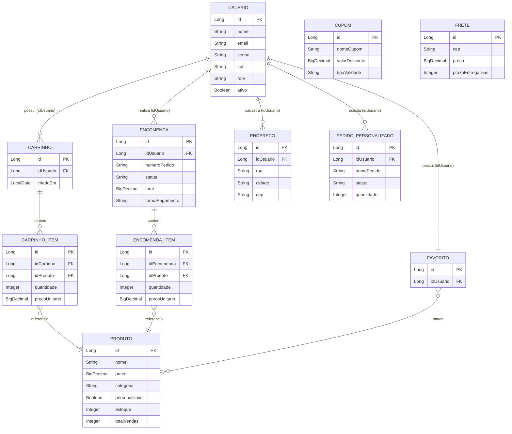

# Documentação
---

## 1. Visão Geral do Sistema

O **MarcaPasso3D** é o backend de um e-commerce especializado em produtos impressos em 3D (luminárias, colecionáveis, acessórios e peças personalizadas). O sistema expõe uma API REST responsável por autenticação e gestão de usuários, catálogo de produtos, carrinho de compras, endereços de entrega, cálculo de frete por CEP, cupons de desconto, fechamento de pedidos (encomendas) com integração de pagamento via Mercado Pago, pedidos personalizados (itens sob encomenda com orçamento), lista de favoritos, notificações administrativas via Telegram e um assistente de chat baseado em IA para auxiliar o cliente a navegar pelo catálogo.

### Principais Tecnologias e Frameworks

| Categoria | Tecnologia |
|---|---|
| Linguagem | Java (uso de *text blocks*, API moderna do Spring Security — compatível com Java 17+) |
| Framework principal | Spring Boot (Spring Web/MVC, Spring Data JPA, Spring Security, Spring Validation, Spring Scheduling) |
| Banco de dados | PostgreSQL (`spring.datasource` apontando para driver `org.postgresql.Driver`, dialect PostgreSQL) |
| ORM | Hibernate / JPA (`jakarta.persistence`), com `ddl-auto=update` |
| Autenticação | JWT (biblioteca `io.jsonwebtoken` / JJWT) com filtro customizado (`JwtAuthFilter`) |
| Segurança de senha | BCrypt (`BCryptPasswordEncoder`, via Spring Security Crypto) |
| Pagamentos | SDK oficial do **Mercado Pago** (Checkout Pro / Preferences API) |
| Integrações externas | API de IA via HTTP (`RestTemplate`) para chatbot e geração de resumos de produto; **Telegram Bot API** (via `RestClient`) para notificação de novos pedidos |
| Serialização | Jackson (`ObjectMapper`, `JsonNode`) |
| Validação | Bean Validation (`jakarta.validation`, anotações `@NotBlank`, `@Email`, `@Valid`) |
| Build/Empacotamento | Maven (padrão de projeto Spring Boot — arquivo `pom.xml`) |
| Testes | JUnit (estrutura em `src/test/java`, ex.: `FreteServiceTest`) |

---

## 2. Arquitetura do Sistema

### 2.1 Padrão de Arquitetura do Backend

O backend segue uma **arquitetura em camadas (Layered Architecture)** típica de aplicações Spring Boot REST, organizada por responsabilidade técnica:

```
Controller  →  Service  →  Repository  →  Banco de Dados (PostgreSQL)
   ↑                                            
   └── DTO (entrada/saída)         Entity / Model (JPA)
```

- **Controller** (`controller/`): camada de borda HTTP. Recebe requisições REST, delega para a camada de serviço e devolve `ResponseEntity`. Não contém regra de negócio.
- **Service** (`service/`): concentra as regras de negócio (validações, cálculos, orquestração entre repositórios, geração de mensagens para integrações externas como Telegram e Mercado Pago).
- **Repository** (`repository/`): interfaces `JpaRepository` (Spring Data JPA) responsáveis pelo acesso a dados, com *query methods* derivados por nome (ex.: `findByIdUsuarioOrderByDataHoraDesc`) e uma consulta JPQL customizada (`ProdutoRepository.findByTermoParaCarrossel`).
- **Model/Entity** (`model/`): entidades JPA mapeadas para as tabelas do PostgreSQL.
- **DTO** (`dto/`): objetos de transferência usados na maioria dos endpoints para desacoplar o contrato da API do modelo interno.
- **Security** (`security/`, `SecurityConfig.java`): configuração de autenticação/autorização stateless via JWT.

É uma **API REST em camadas (Controller–Service–Repository)** com uso parcial do padrão DTO.

### 2.2 Estrutura do Frontend

- O frontend de desenvolvimento roda em `http://localhost:5173` (`app.frontend-url`), porta padrão do **Vite** com Vue consumindo a API via `fetch`/Axios.
- O CORS está liberado para qualquer porta em `localhost` (`http://localhost:*`), o que é adequado apenas para desenvolvimento.
- As URLs de retorno do Mercado Pago (`/pedidos?status=sucesso`, `/checkout?status=falha`, `/pedidos?status=pendente`) chamam as rotas de frontend chamadas `/pedidos` e `/checkout`.

### 2.3 Comunicação Frontend ↔ Backend

- **Protocolo**: API REST sobre HTTP, com payloads em JSON.
- **Autenticação**: JWT (JSON Web Token) no padrão *Bearer*. O token é gerado em `/auth/login` e `/auth/cadastro`, contendo claims customizadas (`email`, `role`, `nome`, `cpf`, `telefone`) além do `subject` (ID do usuário) e expiração (`jwt.expiration-ms`). O frontend deve enviar o header `Authorization: Bearer <token>` em toda requisição autenticada.
- **Sessão**: stateless (`SessionCreationPolicy.STATELESS`) — nenhum estado de sessão é mantido no servidor; cada requisição é validada de forma independente pelo `JwtAuthFilter`.
- **Autorização por papel (Role-based)**: dois papéis, `ADMIN` e `CLIENTE`, controlados via `hasRole("ADMIN")` no `SecurityConfig`. Rotas de leitura de produtos e fretes são públicas; rotas administrativas de cupons, fretes e pedidos personalizados exigem `ADMIN`.
- **CORS**: configurado explicitamente para aceitar métodos `GET, POST, PUT, PATCH, DELETE, OPTIONS` e os headers `Authorization, Content-Type, Accept`, com `allowCredentials = true`.
- **Convenção de rotas**: não é totalmente uniforme — alguns recursos usam o prefixo `/api/...` (`/api/usuarios`, `/api/carrinho`, `/api/cupons`, `/api/encomendas`, `/api/enderecos`, `/api/personalizados`, `/api/pagamentos/mercadopago`) e outros não (`/produtos`, `/fretes`, `/favoritos`, `/auth`, `/chat-ia`).

---

## 3. Modelo de Banco de Dados e Entidades

### 3.1 Lista de Entidades

| Entidade (classe) | Tabela | Descrição |
|---|---|---|
| `Usuario` | `usuarios` | Conta de cliente ou administrador da loja. |
| `Produto` | `produtos` | Item do catálogo (impresso em 3D), com preço, estoque e indicador de personalização. |
| `Carrinho` | `carrinhos` | Carrinho de compras ativo de um usuário. |
| `CarrinhoItem` | `carrinho_itens` | Item (produto + quantidade + preço) dentro de um carrinho. |
| `Encomenda` | `encomendas` | Pedido fechado/finalizado, com snapshot de pagamento, endereço e cliente no momento da compra. |
| `EncomendaItem` | `encomenda_itens` | Item (produto + quantidade + preço) de uma encomenda. |
| `Endereco` | `enderecos` | Endereço de entrega cadastrado por um usuário. |
| `Favorito` | `favoritos` | Lista de produtos favoritos de um usuário. |
| `Frete` | `ceps` | Tabela de referência de CEPs com preço e prazo de entrega. |
| `Cupom` | `cupons` | Cupom de desconto, com validade indefinida ou temporária. |
| `PedidoPersonalizado` | `pedidos_personalizados` | Solicitação de peça sob encomenda (orçamento), com fotos de referência. |

### 3.2 Atributos por Entidade

**`Usuario`** (`usuarios`)
- `id` (Long, PK) — identificador.
- `nome` (String, obrigatório).
- `email` (String, obrigatório, único) — usado como *username* no login.
- `senha` (String, obrigatório) — hash BCrypt, nunca o valor em texto puro.
- `telefone` (String, opcional).
- `cpf` (String, único, opcional).
- `role` (Enum: `ADMIN` | `CLIENTE`, padrão `CLIENTE`).
- `ativo` (Boolean, padrão `true`) — usado para "soft delete" (desativação) via `PATCH /api/usuarios/{id}/desativar`.
- `criadoEm` / `atualizadoEm` (LocalDateTime, preenchidos automaticamente).

**`Produto`** (`produtos`)
- `id` (Long, PK).
- `nome`, `descricao` (TEXT), `resumoIA` (TEXT, resumo gerado por IA), `preco` (BigDecimal), `imagemPrincipal` (String/URL), `personalizavel` (Boolean), `categoria` (String), `material` (String), `estoque` (Integer), `totalVendas` (Integer, contador incrementado a cada venda).

**`Carrinho`** (`carrinhos`)
- `id` (Long, PK), `idUsuario` (Long), `criadoEm` (LocalDate). Possui lista de `CarrinhoItem`.

**`CarrinhoItem`** (`carrinho_itens`)
- `id` (Long, PK), `carrinho` (FK → Carrinho), `produto` (FK → Produto), `quantidade` (Integer), `precoUnitario` (BigDecimal).

**`Encomenda`** (`encomendas`)
- `id` (Long, PK), `idUsuario` (Long), `numeroPedido` (String, único, gerado no padrão `MP-XXXXX`), `dataHora` (LocalDateTime), `status` (Enum `StatusEncomenda`).
- Valores: `subtotal`, `frete`, `desconto`, `descontoCupom`, `total` (todos BigDecimal).
- Pagamento: `formaPagamento` (`pix`/`cartao`), `tipoPagamento`, `bandeiraCartao`, `parcelamento`, `titularCartao`, `cpfTitular`, `binCartao`.
- Endereço (*snapshot* no momento da compra): `endRua`, `endNumero`, `endComplemento`, `endBairro`, `endCidade`, `endEstado`, `endCep`.
- Cliente (*snapshot*): `clienteNome`, `clienteEmail`, `clienteCpf`.
- Possui lista de `EncomendaItem` (cascade total + remoção de órfãos).

**`EncomendaItem`** (`encomenda_itens`)
- `id` (Long, PK), `encomenda` (FK → Encomenda), `produto` (FK → Produto, carregamento *eager*), `quantidade`, `precoUnitario`.

**`Endereco`** (`enderecos`)
- `id` (Long, PK), `idUsuario` (Long), `nome` (rótulo do endereço, ex. "Casa"), `rua`, `numero`, `complemento`, `bairro`, `cidade`, `estado`, `cep`.

**`Favorito`** (`favoritos`)
- `id` (Long, PK), `idUsuario` (Long, único — um registro de favoritos por usuário), `produtos` (lista de `Produto`, relação N:N).

**`Frete`** (`ceps`)
- `id` (Long, PK), `cep` (String, único), `cidade`, `preco` (BigDecimal), `prazoEntregaDias` (Integer), `criadoEm`/`atualizadoEm`.

**`Cupom`** (`cupons`)
- `id` (Long, PK), `nomeCupom` (String, único — funciona como o "código" do cupom), `valorDesconto` (BigDecimal), `tipoValidade` (Enum: `INDEFINIDO` | `TEMPORARIO`), `dataExpiracao` (LocalDate, obrigatória apenas se temporário), `criadoEm`/`atualizadoEm`. Um job agendado (`@Scheduled`, a cada minuto) remove automaticamente cupons temporários expirados.

**`PedidoPersonalizado`** (`pedidos_personalizados`)
- `id` (Long, PK), `idUsuario` (Long), `nomePedido`, `descricao` (TEXT), `finalidade` (TEXT), `tamanho`, `quantidade` (padrão 1), `cores`, `fotosReferencia` (lista de URLs, armazenada em tabela auxiliar `pedido_personalizado_fotos`), `nomeCliente`, `whatsapp`, `prazoDesejadoDias`, `status` (Enum `StatusPedidoPersonalizado`), `criadoEm`/`atualizadoEm`.

### 3.3 Enumerações de Domínio

- `Usuario.Role`: `ADMIN`, `CLIENTE`.
- `StatusEncomenda`: `PENDENTE` → `PAGO` → `ENVIADO` → `ENTREGUE`, ou `CANCELADO`.
- `StatusPedidoPersonalizado`: `AGUARDANDO_ORCAMENTO` → `ORCAMENTO_ENVIADO` → `APROVADO` → `EM_PRODUCAO` → `CONCLUIDO`, ou `CANCELADO`.
- `TipoValidadeCupom`: `INDEFINIDO`, `TEMPORARIO`.

### 3.4 Relações entre Entidades

- **Usuario 1—N Carrinho**, **Usuario 1—N Encomenda**, **Usuario 1—N Endereco**, **Usuario 1—N PedidoPersonalizado**: relações lógicas implementadas via coluna `id_usuario`, **sem** mapeamento `@ManyToOne` formal para `Usuario` no JPA (a integridade é garantida pela camada de serviço, não pelo banco/ORM).
- **Usuario 1—1 Favorito**: cada usuário possui no máximo um registro de favoritos (coluna `id_usuario` é única), igualmente sem relação JPA direta.
- **Carrinho 1—N CarrinhoItem**: relação real `@OneToMany`/`@ManyToOne`, com cascade total.
- **CarrinhoItem N—1 Produto**: cada item do carrinho referencia exatamente um produto.
- **Encomenda 1—N EncomendaItem**: relação real, com cascade total e remoção de órfãos.
- **EncomendaItem N—1 Produto**: idem ao carrinho, com *fetch* `EAGER`.
- **Favorito N—N Produto**: relação `@ManyToMany` real, via tabela de junção `favorito_produtos`.
- **PedidoPersonalizado 1—N fotosReferencia**: coleção de valores simples (`@ElementCollection`), persistida em `pedido_personalizado_fotos`; não é uma entidade própria.
- **Cupom** e **Frete**: entidades de referência **independentes**, sem chave estrangeira para nenhuma outra tabela. Seus valores (desconto e preço de frete) são apenas **copiados como snapshot** para os campos `descontoCupom` e `frete` da `Encomenda` no momento do checkout — não existe um vínculo de FK entre `Encomenda` e `Cupom`/`Frete`.

### 3.5 Diagrama Entidade-Relacionamento (Mermaid)



> Observação: `CUPOM` e `FRETE` foram listados na seção de atributos, mas não aparecem com linhas de relacionamento no diagrama porque, no modelo atual, eles não possuem chave estrangeira para nenhuma outra entidade — são tabelas de referência consultadas pela camada de serviço durante o checkout.

---

## 4. Estrutura de Pastas (Mapa)

```
src/
├── main/
│   ├── java/br/edu/ifpe/MarcaPasso3D/
│   │   ├── MarcaPasso3DApplication.java     # Classe main (@SpringBootApplication, @EnableScheduling)
│   │   ├── SecurityConfig.java              # Regras de autorização por rota, CORS, encoder de senha
│   │   │
│   │   ├── controller/                      # Camada HTTP — recebe requisições REST e devolve respostas
│   │   │   ├── AuthController.java            # Login, cadastro, verificação de token, perfil
│   │   │   ├── CarrinhoController.java        # Carrinho de compras
│   │   │   ├── ChatIAController.java          # Chat com IA e resumo de produto
│   │   │   ├── CupomController.java           # CRUD de cupons (admin)
│   │   │   ├── EncomendaController.java       # Criação/consulta de pedidos finalizados
│   │   │   ├── EnderecoController.java        # CRUD de endereços do usuário
│   │   │   ├── FavoritoController.java        # Lista de favoritos
│   │   │   ├── FreteController.java           # CRUD de fretes por CEP (admin)
│   │   │   ├── MercadoPagoController.java     # Geração de preferência de pagamento
│   │   │   ├── PedidoPersonalizadoController.java # Pedidos sob encomenda (usuário + admin)
│   │   │   ├── ProdutoController.java         # Catálogo de produtos
│   │   │   └── UsuarioController.java         # CRUD administrativo de usuários
│   │   │
│   │   ├── service/                         # Regras de negócio
│   │   │   ├── CarrinhoService.java
│   │   │   ├── ChatIAService.java             # Monta prompts e chama a API de IA externa
│   │   │   ├── CupomService.java              # Inclui job agendado de expiração
│   │   │   ├── EncomendaService.java          # Orquestra criação de pedido + notificação Telegram
│   │   │   ├── EnderecoService.java
│   │   │   ├── FavoritoService.java
│   │   │   ├── FreteService.java
│   │   │   ├── MercadoPagoService.java        # Integração com SDK do Mercado Pago
│   │   │   ├── PedidoPersonalizadoService.java
│   │   │   ├── ProdutoService.java
│   │   │   ├── TelegramService.java           # Envio de mensagens/fotos via Bot API
│   │   │   └── UsuarioService.java
│   │   │
│   │   ├── repository/                      # Interfaces Spring Data JPA, uma subpasta por domínio
│   │   │   ├── Carrinho/  Cupom/  Encomenda/  Endereço/  Favorito/  Frete/  Personalizado/  Produto/  Usuario/
│   │   │
│   │   ├── model/                           # Entidades JPA, também organizadas por domínio
│   │   │   ├── Carrinho/  Cupom/  Encomenda/  Endereço/  Frete/  Personalizado/
│   │   │   ├── Produto.java
│   │   │   ├── Usuario.java
│   │   │   └── Favorito.java
│   │   │
│   │   ├── dto/                             # Objetos de entrada/saída da API, por domínio
│   │   │   ├── Cupom/  Encomenda/  Frete/  IA/  MercadoPago/  Personalizado/
│   │   │   └── (DTOs de Usuário, Login, Carrinho, etc. na raiz de dto/)
│   │   │
│   │   └── security/                        # Infraestrutura de autenticação
│   │       ├── JwtUtil.java                   # Geração/validação/parsing do token
│   │       └── JwtAuthFilter.java             # Filtro que popula o SecurityContext a partir do header Authorization
│   │
│   └── resources/
│       ├── application.properties           # Configurações de datasource, JWT, Mercado Pago, IA, Telegram
│       └── data.sql                          # Script de seed (CEPs e catálogo inicial de produtos)
│
└── test/
    └── java/br/edu/ifpe/MarcaPasso3D/
        ├── MarcaPasso3DApplicationTests.java
        └── service/FreteServiceTest.java
```

**Papel das pastas mais importantes**

- `controller/`: ponto de entrada HTTP; nenhuma lógica de negócio deve viver aqui.
- `service/`: onde as regras de negócio, validações e orquestrações entre repositórios/integrações externas (Mercado Pago, Telegram, IA) acontecem.
- `repository/`: contrato de acesso a dados (Spring Data JPA gera a implementação em tempo de execução).
- `model/`: o "vocabulário" do domínio mapeado para tabelas reais do PostgreSQL.
- `dto/`: contratos da API, isolando o que é exposto publicamente do modelo interno (parcialmente aplicado — ver observações da Seção 2.1).
- `security/`: tudo relacionado à emissão e validação de JWT e ao filtro que autentica cada requisição.
- `resources/`: configuração externa (`application.properties`) e dados de inicialização (`data.sql`).

---
